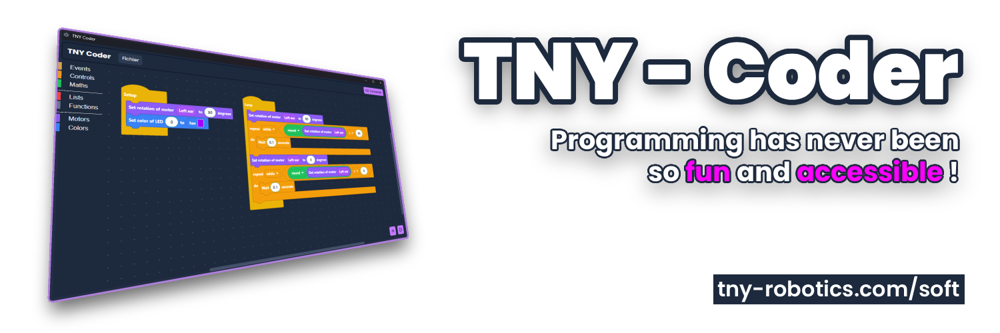

<div align="center">

# TNY-Coder

[](https://creativecommons.org/licenses/by-nc-sa/4.0/)
[](https://nuxt.com/)
[](https://www.electronjs.org/)

**Programming has never been so fun and accessible! A visual, block-based platform to bring your TNY robots to life.**

[🌐 Website](https://tny-robotics.com/) • [📘 Documentation](https://tny-robotics.com/docs) • [💬 Discord](https://discord.gg/XGABkx5A4y)

</div>

---

## 🚀 Download & Play

You don't need to build the application from source to start coding! 

Pre-built, ready-to-use releases for **Windows, macOS, and Linux** are available directly in the [Releases](../../releases) section on the right sidebar of this repository.

For full instructions on how to use the blocks and connect your robot, check out our official documentation:
👉 **[tny-robotics.com/docs](https://tny-robotics.com/docs/TNY-360/usage/desktop-app)**

---

## ✨ Features

* **🧩 Visual Programming:** Powered by **Blockly**, offering an intuitive, Scratch-like interface designed for young and curious minds.
* **🔌 Real-Time Connection:** Connect the app directly to your physical TNY-360 robot or a virtual simulator via **WebSockets**.
* **🤖 Complete Robot Control:** Easily assemble blocks to control individual motors, define leg positions (Inverse Kinematics), adjust body orientation, and trigger complex movements.
* **💻 Cross-Platform:** A standalone desktop application available for all major operating systems.

## ⚙️ Tech Stack

TNY-Coder is built on modern web technologies to ensure a smooth and responsive experience across all platforms. *(Forked from the [ElectronNuxt-Template](https://github.com/FurWaz/ElectronNuxt-Template))*

* **Frontend:** Nuxt.js & Vue.js
* **Styling:** Tailwind CSS
* **Desktop Environment:** Electron
* **Block Engine:** Google Blockly

---

## 💻 Developer Quick Start

Want to contribute, modify the app, or build it yourself? Here is everything you need.

### Prerequisites
* [Node.js](https://nodejs.org/) v14 or later
* [NPM](https://www.npmjs.com/) v6 or later

### Installation

1. **Clone** the repository:
```bash
git clone [https://github.com/TNY-Robotics/TNY-Coder.git](https://github.com/TNY-Robotics/TNY-Coder.git)
```

2. **Install** dependencies:
```bash
cd TNY-Coder
npm install
```

### Running the App (Development)

You can run the application either in a standard web browser or inside the Electron wrapper.

* **In browser:**
```bash
npm run dev
```

* **In electron:**
```bash
npm run dev:electron
```

### Building the App (Production)

* **Nuxt web server:**
```bash
npm run build
```

* **Static website:**
```bash
npm run generate
```

* **Electron app (Generates the OS executables):**
```bash
npm run build:electron
```

> [!NOTE]
> **For Windows Users:** Building the Electron app on Windows requires the terminal session to be run as an Administrator for the first time, as described in [this issue](https://github.com/electron-userland/electron-builder/issues/8149).

---

## 📂 Repository Structure

* `app/` — **Web Core.** Contains the Nuxt/Vue pages, components, and Blockly logic.
* `i18n/` — **Translations.** All the translations used in the application. Feel free to add your own language!
* `electron/` — **Desktop Core.** Contains the Electron main process and WebSocket server logic.

## 🤝 Contributing

We love contributions!

* **Code:** Feel free to fork the repository and submit a PR to add new blocks or improve the UI.
* Found a bug or have an idea for a new feature? [Open an Issue](https://www.google.com/search?q=https://github.com/TNY-Robotics/TNY-Coder/issues).

## 📄 License & Authors

**TNY-Coder** is maintained by the [TNY Robotics Team](https://tny-robotics.com).

Licensed under **CC BY-NC-SA 4.0**.<br>
*You are free to share and adapt this material for non-commercial purposes, as long as you provide attribution and share alike.*

[](http://creativecommons.org/licenses/by-nc-sa/4.0/)

Need help? Contact us [by mail](mailto:contact@tny-robotics.com) or join our [Discord](https://discord.gg/XGABkx5A4y).
